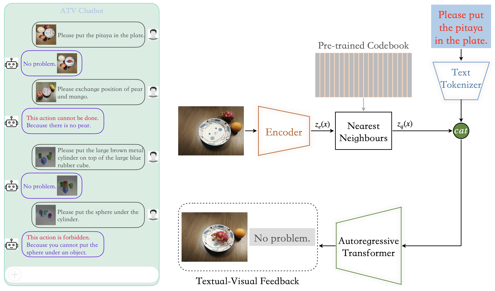

## Accountable Textual-Visual Chat Learns to Reject Human Instructions in Image Re-creation

The *official* repository for [Accountable Textual-Visual Chat Learns to Reject
Human Instructions in Image Re-creation]().



### Requirements

- Python 3.6
- matplotlib == 3.1.1
- numpy == 1.19.4
- pandas == 0.25.1
- scikit_learn == 0.21.3
- torch == 1.8.0

## Citation
If you find this code useful for your research, please cite our paper
```
@article{zhang2023accountable,
  title={Accountable Textual-Visual Chat Learns to Reject Human Instructions in Image Re-creation},
  author={Zhang, Zhiwei and Liu, Yuliang},
  journal={arXiv preprint arXiv:2303.05983},
  year={2023}
}
```
